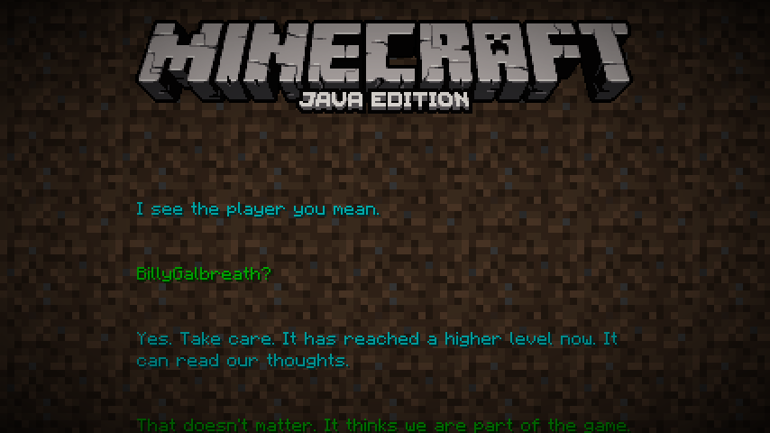

Purpur adds a few new commands to the game.

* `/purpur`
    - This command allows reloading the purpur.yml config and viewing the purpur version.

    - **examples**:
        - `/purpur reload` reloads purpur.yml without a restart
        - `/purpur version` shows the current version (same as `/version`)

    - **permission**:
        - `bukkit.command.purpur`

* `/ping`
    - This command allows viewing the ping of players. If you do not specify a player name or player entity selector (`@a`, `@r`, etc) it will show you your own ping.

    - **examples**
        - `/ping` shows you your own ping
        - `/ping BillyGalbreath` shows you the ping of BillyGalbreath
        - `/ping @a` shows you the ping of all players
        - `/ping @r` shows you the ping of a random player

    - **permission**:
        - `bukkit.command.ping`

* `/demo`
    - This command shows the demo screen to players. If you do not specify a player name or player entity selector (`@a`, `@r`, etc) it will show the demo screen to yourself.

    - **examples**
        - `/demo` shows you the demo screen
        - `/demo BillyGalbreath` shows BillyGalbreath the demo screen
        - `/demo @a` shows the demo screen to all players
        - `/demo @r` shows the demo screen to a random player

    - **permission**:
        - `bukkit.command.demo`

    { width="496" }

* `/credits`
    - This command shows the credits screen to players. If you do not specify a player name or player entity selector (`@a`, `@r`, etc) it will show the credits screen to yourself.

    - **examples**
        - `/credits` shows you the credits screen
        - `/credits BillyGalbreath` shows BillyGalbreath the credits screen
        - `/credits @a` shows the credits screen to all players
        - `/credits @r` shows the credits screen to a random player

    - **permission**:
        - `bukkit.command.credits`

  { width="496" }
