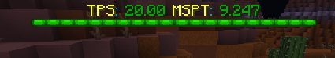

Purpur adds a few new commands to the game.

## /purpur
- This command allows reloading the purpur.yml config and viewing the purpur version.

- **examples**:
    - `/purpur reload` reloads purpur.yml without a restart
    - `/purpur version` shows the current version (same as `/version`)

- **permission**:
    - `bukkit.command.purpur`

## /ping
- This command allows viewing the ping of players. If you do not specify a player name or player entity selector (`@a`, `@r`, etc) it will show you your own ping.

- **examples**
    - `/ping` shows you your own ping
    - `/ping BillyGalbreath` shows you the ping of BillyGalbreath
    - `/ping @a` shows you the ping of all players
    - `/ping @r` shows you the ping of a random player

- **permission**:
    - `bukkit.command.ping`

## /demo
??? info "Image of the Demo Screen 📷"
    
- This command shows the demo screen to players. If you do not specify a player name or player entity selector (`@a`, `@r`, etc) it will show the demo screen to yourself.

- **examples**
    - `/demo` shows you the demo screen
    - `/demo BillyGalbreath` shows BillyGalbreath the demo screen
    - `/demo @a` shows the demo screen to all players
    - `/demo @r` shows the demo screen to a random player

- **permission**:
    - `bukkit.command.demo`

## /credits
??? info "Image of the Credits screen 📷"
    
- This command shows the credits screen to players. If you do not specify a player name or player entity selector (`@a`, `@r`, etc) it will show the credits screen to yourself.

- **examples**
    - `/credits` shows you the credits screen
    - `/credits BillyGalbreath` shows BillyGalbreath the credits screen
    - `/credits @a` shows the credits screen to all players
    - `/credits @r` shows the credits screen to a random player

- **permission**:
    - `bukkit.command.credits`

## /tpsbar
??? info "Image of the tpsbar in action 📷"
    
- This command shows a bossbar showcasing your current TPS/MSPT to players. If you do not specify a player name or player entity selector (`@a`, `@r`, etc) it will show the tpsbar to yourself.

- **examples**
    - `/tpsbar` shows you the tpsbar
    - `/tpsbar BillyGalbreath` shows BillyGalbreath the tpsbar
    - `/tpsbar @a` shows the tpsbar to all players
    - `/tpsbar @r` shows the tpsbar to a random player

- **permission**:
    - `bukkit.command.tpsbar`