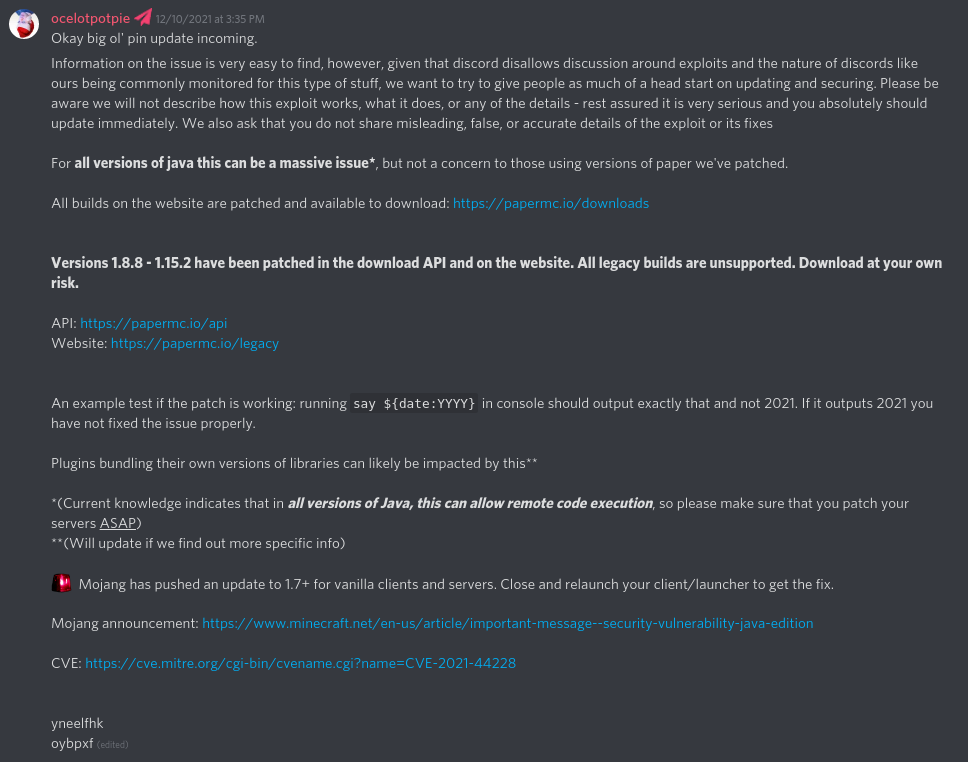
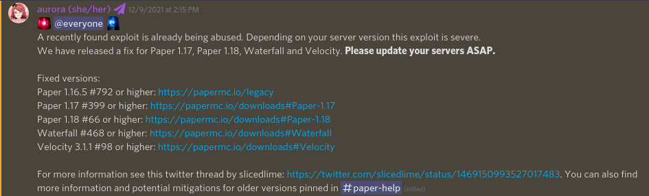

# Log4j security vulnerability
A remote code execution (RCE) vulnerability was found within the logger library utilized in Minecraft and many other Java-based applications. This vulnerability allows anybody to execute commands and run code on your server with minimal effort, and grab your backend server’s public IP address.

It exists for all vanilla Minecraft versions newer than 1.7.10, and affects every application that utilizes the library. Notably the vanilla client, all vanilla-based servers such as Paper and Purpur, Velocity, and Waterfall. If you run any other Java-based applications, such as Jenkins or UniFi, ensure they are up-to-date as well.

Mojang has pushed a fix for all client versions 1.8 and newer. 1.7.10 and older are not vulnerable. Purpur has pushed a JAR containing a fix for 1.18.1, and published XML files for 1.18 and older. Plugins that shade or depend on older versions of the library will also require updates.

## Updating Purpur
Due to the way our tooling works, we cannot push fixed JARs for versions older than the latest Minecraft release. Now is a good time to get off unsupported versions and onto the latest and greatest versions of the game.

### 1.18.1 and newer
1.18.1 Builds [`#1464`](https://api.purpurmc.org/v2/purpur/1.18.1/1464/download) and newer are patched. [Download the latest builds here]({{ project.downloads }}).

### 1.18 to 1.17
As stated above, Purpur does not provide a patched JAR. Instead, we provide an XML file that disables what causes the exploit. To install, <a download href="../xml/purpur_log4j2_117.xml" >download this XML file</a>, place it in your server’s root directory (where the JAR files are), and add `-Dlog4j.configurationFile=purpur_log4j2_117.xml` after `java` in your launch arguments.

???+ warning "Warning"
    This method has not been fully tested on 1.18. Report any issues found on the documentation's [issue tracker](https://github.com/PurpurMC/PurpurDocs/issues).

### 1.16.5 and older
The process is the same as the above, but with a different XML file. <a download href="../xml/purpur_log4j2_1141-1165.xml" >Download this XML file</a> to your server’s root directory, and add `-Dlog4j.configurationFile=purpur_log4j2_1141-1165.xml` after `java` in your launch arguments.

Beware of other plugins that claim to fix the exploit by redirecting the log to the system output stream, as Paper automatically redirects those calls back to Log4j. Filtering out the problematic string will not patch the exploit, as all filters can be bypassed in various ways.

## How it works
To test if this exploit affects you, send `${jndi:ldap://127.0.0.1:1389/a}` in your server’s chat, and check your server’s log. If the console shows *any* response, then your server is vulnerable.

The flag, `-Dlog4j2.formatMsgNoLookups=true`, does not stop the exploit from functioning on versions older than 1.17. It only works on versions newer than 1.16.5, which already have better mitigations provided.

A basic explanation of how the exploit works can be found [here](https://gist.github.com/TheCurle/f15a6b63ceee3be58bff5e7a97c3a4e6#the-problem). Current knowledge indicates that all versions of Java can allow remote code execution, according to [Paper’s team](https://discord.com/channels/289587909051416579/289587909051416579/918964269415030855)[^1].

For more information, read [Mojang’s blog post about the vulnerability](https://www.minecraft.net/en-us/article/important-message--security-vulnerability-java-edition). It contains fixes for other platforms, such as third-party clients. Paper’s [information post](https://discord.com/channels/289587909051416579/289587909051416579/918964269415030855)[^1] and [announcement](https://discord.com/channels/289587909051416579/492517675680006144/918581596825718815)[^2] may help as well.

[^1]: 
[^2]: 
